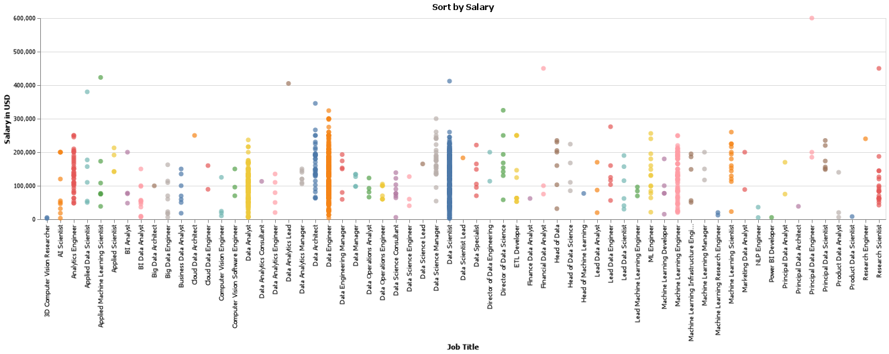
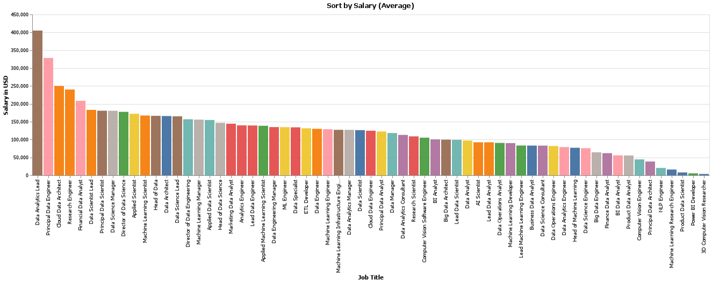
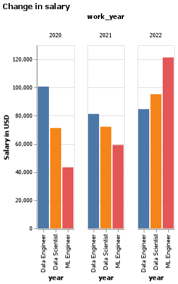

# Client Report - AI/ML Salaries
__Marcel Pratikto__

## Elevator Pitch
This data analysis project will analyze the following dataset:
https://www.kaggle.com/datasets/cedricaubin/ai-ml-salaries
I'm doing this because I'm interested in pursuing a career in AI/Machine Learning.

### GRAND QUESTION 1
#### Salary by position
The table, which only shows the top 5 salaries, tells us that the highest salary job is Principal Data Engineer at \$600,000.
When using a scatter plot to get a better overview of the data, however, we see that on average the highest paying job is not Principal Data Engineer.
The second table shows that the job with the highest average salary is Data Analytics Lead at \$405,000.

##### TECHNICAL DETAILS
|   work_year | experience_level   | job_title                                |   salary_in_usd |
|------------:|:-------------------|:-----------------------------------------|----------------:|
|        2021 | EX                 | Principal Data Engineer                  |          600000 |
|        2020 | MI                 | Research Scientist                       |          450000 |
|        2021 | MI                 | Financial Data Analyst                   |          450000 |
|        2021 | MI                 | Applied Machine Learning Scientist       |          423000 |
|        2020 | SE                 | Data Scientist                           |          412000 |

| job_title                                |   salary_in_usd |
|:-----------------------------------------|----------------:|
| Data Analytics Lead                      |          405000 |
| Principal Data Engineer                  |          328333 |
| Cloud Data Architect                     |          250000 |
| Research Engineer                        |          240000 |
| Financial Data Analyst                   |          208333 |
| Data Scientist Lead                      |          183000 |
| Principal Data Scientist                 |          180641 |
| Data Science Manager                     |          180533 |
| Director of Data Science                 |          177487 |
| Applied Scientist                        |          172150 |
| Machine Learning Scientist               |          167235 |
| Head of Data                             |          166346 |
| Data Architect                           |          165779 |
| Data Science Lead                        |          165000 |
| Director of Data Engineering             |          156738 |
| Machine Learning Manager                 |          155701 |
| Applied Data Scientist                   |          154712 |
| Head of Data Science                     |          146718 |
| Marketing Data Analyst                   |          144327 |
| Analytics Engineer                       |          139713 |
| Lead Data Engineer                       |          139372 |
| Applied Machine Learning Scientist       |          138525 |
| Data Engineering Manager                 |          134856 |

### GRAND QUESTION 2
#### Salary by year
For this question, I'm not going to focus on the highest paying jobs, but on the jobs that I'm more likely to apply to. I want to see the change in salary for the following jobs that are more common:
* Data Engineer
* Data Scientist
* ML Engineer (I decided to combine Machine Learning Engineer with ML Engineer since they're the same)

ML Engineers have seen a huge spike in salary.

##### TECHNICAL DETAILS
|    |   work_year |   salary_in_usd | job_title      |
|---:|------------:|----------------:|:---------------|
|  0 |        2020 |          100656 | Data Engineer  |
|  1 |        2021 |           81254 | Data Engineer  |
|  2 |        2022 |           84666 | Data Engineer  |
|  3 |        2020 |           71256 | Data Scientist |
|  4 |        2021 |           72144 | Data Scientist |
|  5 |        2022 |           95242 | Data Scientist |
|  6 |        2020 |           43331 | ML Engineer    |
|  7 |        2021 |           59186 | ML Engineer    |
|  8 |        2022 |          121284 | ML Engineer    |

### GRAND QUESTION 3
#### Salary by experience level
The average salary, in the years provided by the dataset, are shown in the table below.
It is in alphabetical order instead of seniority.
* EN: $61,140
* MI: $91,129
* SE: $145,077
* EX: $189,427

That is an almost 3x increase in salary from entry level to executive level!

##### TECHNICAL DETAILS
| experience_level   |   salary_in_usd |
|:-------------------|----------------:|
| EN                 |           61140 |
| EX                 |          189427 |
| MI                 |           91129 |
| SE                 |          145077 |